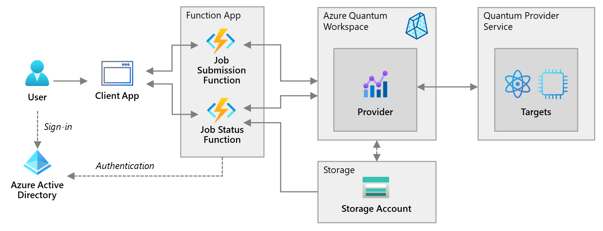

# DevOps for Quantum Computing
This repo contains everything you need to show how DevOps could work for hybrid quantum applications.



## Getting Started

### Create a fork of this repository

In the top-right corner of this page, click **Fork**. Select an organization where you'd like to fork this repo to. Continue to work from there for the following steps.

For a more detailed description about how to create Forks, have a look at the [Fork a repo](https://docs.github.com/en/get-started/quickstart/fork-a-repo) documentation on [https://docs.github.com](https://docs.github.com).

### Create Azure Credentials

Follow instructions on [Deploy ARM templates by using GitHub Actions](https://docs.microsoft.com/azure/azure-resource-manager/templates/deploy-github-actions) for creating deployment credentials for GitHub. This includes creating a service principal and assigning **Contributor**-role to him.

The service principal generation should output JSON in following format:

Copy this JSON object for later. You will only need the sections with the `clientId`, `clientSecret`, `subscriptionId`, and `tenantId` values.

```output
  {
    "clientId": "<GUID>",
    "clientSecret": "<GUID>",
    "subscriptionId": "<GUID>",
    "tenantId": "<GUID>",
    (...)
  }
```

### Configure Actions secrets

You need to create secrets for your Azure credentials and your subscription.

- **AZURE_CREDENTIALS** with the JSON output generated during the service principal creation.
- **AZURE_SUBSCRIPTION** with the Azure subscription ID (you can take the one from the JSON output)

Configure these secrets as follows:

1. In [GitHub](https://github.com/), browse your repository.

1. Select **Settings > Secrets > Actions > New repository secret**.

1. Paste the entire JSON output from the Azure CLI command into the secret's value field. Give the secret the name `AZURE_CREDENTIALS`.

1. Create a second secret named `AZURE_SUBSCRIPTION`. Add your subscription ID to the secret's value field (example: `90fd3f9d-4c61-432d-99ba-1273f236afa2`).

### Change the workflows (if needed)

You might want to change following settings in the GitHub action workflows (but in sync in all workflow definitions)

- **AZURE_FUNCTIONAPP_NAME** - name of the application (names of other resources will be derived from)
- **AZURE_RESOURCE_GROUP_NAME** - (change optional) - the resource group the deployment should be targeted to
- **AZURE_RESOURCE_GROUP_LOCATION** - (change optional) - the region of all deployment artifacts (including the resource group)

Important: you have to change the application name (AZURE_FUNCTIONAPP_NAME) because various resource names that must be globally unique are derived from this setting.

### Manually trigger the deployment workflows (CI)

Manually trigger following actions:

1. CI Infrastructure Deployment
1. CI App Deployment

### Clean up resources

After you finished working with the generated resources, clean up your subscription by deleting the generated resource group.

```AzureCli
    az group delete --name myResourceGroup
```
